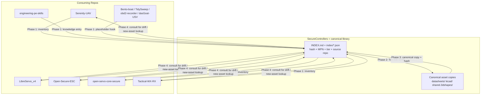

# feat: Workspace-wide reusable-resource library and master index

**Target repo:** SecureControllers (becomes canonical). Consuming repos referenced by
name: Serenity-UAV, LibreServo_v4, Open-Secure-ESC, open-servo-core-secure,
Tactical-WX-RX, engineering-pe-skills, plus placeholder hooks for Bento-boat,
TidySweep, obd2-recorder, and dasGoat-USV (the confirmed-empty repos in the
Browncoats workspace, `~/Documents/Vocation/Employers/Griffing.tech/designs/`).

**Product Contract preservation:** N/A — no origin document; this plan originates from
a direct user request (`ce-plan-bootstrap`), refined by a solo scoping-synthesis
confirmation (repo scope, verification depth) before research began.

---

## Summary

The Browncoats workspace (11 git repos under `designs/`) has accumulated reusable
hardware assets — datasheets, KiCad symbols/footprints, STEP/mechanical shapes,
firmware/tooling scripts — independently in each repo, with **confirmed duplication**
(26 identically-named PDFs already live in both `Serenity-UAV/avionics/datasheets/`
and `SecureControllers/datasheets/`, with no mechanism to detect drift between them).
This plan builds a single **master resource index** cataloging every reusable asset
workspace-wide, verifies each entry's fidelity at a tier matched to its risk, and
establishes `SecureControllers` as the canonical **copy-with-index** library: canonical
files live there with recorded hashes; consuming repos keep their own local copies and
use the index to detect drift rather than symlinking or submoduling.

## Problem Frame

- No repo can currently answer "is there already a verified footprint/datasheet for
  part X anywhere in the workspace?" without a manual grep across up to 9 repos.
- `SecureControllers` already contains verified fidelity work (e.g. the 2026-07-13
  Wash footprint-vs-datasheet audit found in its `TODO.md`) that other repos have no
  way to discover or reuse.
- Duplicate copies of the same datasheet/footprint in different repos can silently
  diverge (wrong revision, hand-edited footprint) with nothing to catch it.
- A full per-file, pin-level fidelity pass across ~300 files is not affordable in one
  pass — verification effort must be tiered to risk (confirmed via scoping synthesis).

## Requirements

- **R1**: Every reusable hardware asset (datasheet PDF, `.kicad_sym`, `.kicad_mod`,
  reusable STEP/SCAD/STL primitive, reusable script/tool) in an asset-bearing repo is
  cataloged in the master index with: repo, path, SHA-256 hash, part number/MPN
  (where applicable), and verification tier.
- **R2**: `engineering-pe-skills` is included in the index as a **knowledge asset**
  (skills/reference content), not as hardware, per user direction.
- **R3**: The four confirmed-empty repos (`Bento-boat`, `TidySweep`, `obd2-recorder`,
  `dasGoat-USV`) get a **placeholder hook** in the index — an entry that says "no
  assets yet, consult this index when starting hardware work" — not a full scan cycle.
- **R4**: Verification runs at three tiers (per scoping synthesis, "Tiered"):
  - **Tier A (full pin/pad verification)**: flight-critical parts and any asset
    already flagged as suspect (e.g. the 7 known-bad Wash footprints).
  - **Tier B (provenance + hash-consistency)**: everything else — confirm the right
    manufacturer/part/revision, and flag same-named files across repos whose hashes
    differ (drift) for later Tier-A escalation.
  - **Tier C (placeholder)**: R3 hooks — no file to verify yet.
- **R5**: The master index is structured for **minimum token cost to consult** — an
  agent or human must be able to look up one part/asset without reading whole repos or
  the full index; supports lookup by MPN, by repo, or by asset type.
- **R6**: `SecureControllers` is designated canonical: for every asset with copies in
  multiple repos, one copy (verified, hash-recorded) is authoritative in
  `SecureControllers`; consuming repos keep their local copies indefinitely under this
  plan (no automatic sync), and drift is resolved per-conflict as a user decision
  recorded in `verification_log.md` (U4/U5), while the index always names the
  canonical source.
- **R7**: No datasheet, standard, or citation is fabricated — every catalog entry with
  a manufacturer/part claim must trace to the actual file's own content or a verifiable
  distributor/manufacturer source (per user's global CLAUDE.md authenticity policy).
- **R8**: Governance artifacts (`TODO.md` WBS entries, `AGENTS.md`/`CLAUDE.md`
  pointers) are updated per each repo's existing federation conventions, not
  reinvented.

## Scope Boundaries

**In scope:** Serenity-UAV, SecureControllers, LibreServo_v4, Open-Secure-ESC,
open-servo-core-secure, Tactical-WX-RX (asset-bearing), engineering-pe-skills
(knowledge-asset), and placeholder hooks for Bento-boat, TidySweep, obd2-recorder,
dasGoat-USV.

**Out of scope (this plan):**
- Actually moving/copying/deduplicating files into `SecureControllers` in bulk — Phase
  3 seeds the canonical copy only for assets already confirmed identical or explicitly
  chosen; large-scale consolidation of divergent duplicates is Phase 3's per-asset
  decision, not an automatic bulk move.
- Rewriting any repo's KiCad projects to point at `SecureControllers` paths (symlinks
  were explicitly rejected in scoping).
- Git submodule/subtree wiring — explicitly rejected in favor of copy+index.

### Deferred to Follow-Up Work

- Automated CI check that re-hashes the index against live files and fails on drift
  (natural next step once the index exists, but out of scope for first cut).
- Full Tier-A verification of every Tier-B asset — flagged for later escalation as
  each part becomes flight-critical or is touched again.
- Populating placeholder-hook repos with real assets when their hardware work starts.

---

## Key Technical Decisions

**KTD1 — Copy-with-index, not submodule/symlink** *(session-settled: user-directed —
chosen over git submodule/subtree and filesystem symlinks: submodules add workflow
overhead to every consuming repo; symlinks break when repos are cloned individually
off this machine)*. `SecureControllers` holds canonical copies with recorded hashes;
consuming repos keep local copies and consult the index to check for drift.

**KTD2 — Tiered fidelity verification** *(session-settled: user-directed — chosen over
full deep verification of all ~300 files or a provenance-only pass: full verification
of every asset is not affordable in one pass, provenance-only would leave known-risk
footprints unchecked)*. Tier A = flight-critical/flagged parts get full pin/pad
verification against source datasheets; Tier B = everything else gets provenance +
cross-repo hash-consistency; Tier C = placeholder hooks for empty repos.

**KTD3 — Index format: flat, greppable, sharded by asset type** — A single giant JSON
or Markdown table forces any consumer to load the whole file for one lookup. Instead:
one lightweight `INDEX.md` (human/agent overview + how-to-consult instructions) plus
machine-readable per-type manifests (`index/datasheets.json`, `index/kicad-symbols.json`,
`index/kicad-footprints.json`, `index/shapes.json`, `index/scripts.json`,
`index/knowledge.json`, `index/placeholders.json`) so a lookup for "do we have a
footprint for ISOW1044" reads one small JSON file, not the whole catalog. Rationale:
directly serves R5 (minimum token cost to consult).

**KTD4 — `engineering-pe-skills` indexed as knowledge, not hardware** *(session-settled:
user-directed)* — gets its own `index/knowledge.json` manifest entry type distinct from
the physical-asset manifests, since it has no MPN/hash-drift concerns in the same sense
but is still a citable, reusable resource.

**KTD5 — Placeholder-hook shape** *(session-settled: user-directed — chosen over full
scans of empty repos or omitting them entirely)* — each placeholder-hook repo gets one
`index/placeholders.json` entry: repo name, path, and a one-line "when this repo starts
hardware work, add its assets here and to the type manifests above" instruction. No
scan, no hash, no per-file entries until real assets exist.

---

## High-Level Technical Design

Each phase below is a separately reviewable stage; Phase 1 is read-only and safe to run
without further confirmation, Phases 2-4 each end at a checkpoint before the next
begins (per the original staging request).

---

## Implementation Units

### U1. Build the inventory scanner and generate raw asset lists

**Goal:** Produce a complete, deduplicated-by-path list of every candidate asset across
the 6 asset-bearing repos plus the engineering-pe-skills knowledge repo, with basic
metadata (path, size, SHA-256, extension-based type classification).

**Requirements:** R1, R2, R3

**Dependencies:** None

**Files:**
- `tools/inventory_scan.py` (new, in `SecureControllers`) — walks the workspace root,
  classifies files by extension (`.pdf` → datasheet, `.kicad_sym`, `.kicad_mod`,
  `.step`/`.stp`/`.wrl`/`.stl` → shape, recognized shared-tool scripts → script), computes
  SHA-256, writes raw JSON per repo to `index/_raw/<repo>.json`.
- `index/_raw/` (new directory) — intermediate output, not the consumer-facing index.
- `index/placeholders.json` (new) — emitted directly for the 4 confirmed-empty repos
  per KTD5, not via the scan path.

**Approach:**
1. Enumerate the 6 asset-bearing repos by absolute workspace path (config list at top
   of the script, not hardcoded inline — next repo added later just extends the list).
2. For each repo, walk the tree (respecting `.gitignore` where present) and emit one
   record per matched file: `{repo, rel_path, ext, size_bytes, sha256, mtime}`.
3. Separately handle `engineering-pe-skills`: catalog its skill directories/files as
   knowledge-asset records (no hash-drift semantics needed, but hash still recorded for
   integrity).
4. Emit `index/placeholders.json` directly for the 4 empty repos per KTD5 (no scanning
   needed — their emptiness was already confirmed).
5. Cross-repo duplicate detection, two passes: (a) group raw records by `(basename,
   ext)` across repos, flagging groups with >1 repo as `possible_duplicate: true` —
   this is exactly how the known 26 duplicate-named `Serenity-UAV`/`SecureControllers`
   PDFs get surfaced systematically instead of relying on the one-off `comm` check
   already run manually; (b) separately group raw records by `sha256` alone (ignoring
   basename) across repos, flagging hash-matched groups whose basenames differ as
   `renamed_duplicate: true` — this catches content-identical files that were copied
   under a different filename, which pass (a) alone would miss entirely. Both flag
   types feed the same Phase 2 Tier-A/Tier-B escalation path in U4.

**Patterns to follow:** Existing repo-scanning conventions in
`SecureControllers/kicad/*.py` generator scripts (plain stdlib, no manifold3d/kiutils
dependency per `env_kiutils_missing` — avoid importing kiutils; this script only reads
file bytes/paths, so it has no KiCad-library dependency at all).

**Test scenarios:**
- Running the scanner against a repo with 3 known PDFs, 1 `.kicad_sym`, 1 `.step`
  produces exactly 5 records with correct `ext` classification.
- A file present in two repos with identical bytes is grouped as `possible_duplicate`
  with matching hashes.
- A file present in two repos with the **same basename but different hash** is flagged
  distinctly (this is the drift case Phase 2 must escalate to Tier A).
- Running against one of the 4 confirmed-empty repos produces zero raw records (handled
  by the placeholder path, not the scanner).
- Re-running the scanner is idempotent — same inputs produce byte-identical JSON
  output (stable key ordering) so re-runs don't spuriously diff in git.

**Verification:** `index/_raw/*.json` exists for all 6 scanned repos and
`index/placeholders.json` exists with 4 entries; spot-check record counts against the
`find`-based counts already gathered (Serenity-UAV: 147 pdf/30 sym/54 mod/6 step;
SecureControllers: 38/8/15/36; LibreServo_v4: 15/2/22/0; Open-Secure-ESC: 58/20/9/1;
open-servo-core-secure: 11/1/40/36; Tactical-WX-RX: 3/0/0/0).

---

### U2. Classify assets by type and part number, write typed manifests

**Goal:** Turn the raw per-repo scan into the consumer-facing, type-sharded manifests
(`index/datasheets.json`, `index/kicad-symbols.json`, `index/kicad-footprints.json`,
`index/shapes.json`, `index/scripts.json`, `index/knowledge.json`) that R5 requires for
low-token lookup.

**Requirements:** R1, R2, R5, KTD3

**Dependencies:** U1

**Files:**
- `tools/build_manifests.py` (new) — reads `index/_raw/*.json`, writes the typed
  manifests under `index/`.
- `index/datasheets.json`, `index/kicad-symbols.json`, `index/kicad-footprints.json`,
  `index/shapes.json`, `index/scripts.json`, `index/knowledge.json` (new).

**Approach:**
1. For datasheets: attempt MPN extraction from filename (many already carry it, e.g.
   `KSZ9477S-Data-Sheet-DS00002392C.pdf`, `SLB_9670VQ20_Infineon.pdf`) and record
   `mpn_guess` — Phase 2 confirms or corrects this against actual PDF content, this unit
   does not read PDF text.
2. For KiCad symbols/footprints: record the library name, symbol/footprint name, and
   owning repo — do not parse S-expression pin geometry here (that's Tier A/B work in
   Phase 2).
3. For shapes: record whether a `.step`+`.wrl` pair exists for the same basename
   (common KiCad 3D-model convention seen in `SecureControllers/shared.3dshapes/`) and
   flag singletons (only one of the pair present) as a completeness note, not a defect.
4. For `engineering-pe-skills`: one `knowledge.json` entry per skill directory with a
   one-line description pulled from its own README/SKILL frontmatter if present.
5. Each manifest entry carries a `verification_tier` field initialized to `"unverified"`
   — Phase 2 fills in `A`/`B`/`C`.

**Patterns to follow:** `SecureControllers/kicad/README.md` conventions for how boards
already document their own symbol/footprint provenance (informs the manifest schema).

**Test scenarios:**
- A datasheet named `isow1044.pdf` produces `mpn_guess: "ISOW1044"` or similar
  normalized guess.
- A `.step`/`.wrl` pair for the same basename produces one shape entry noting both
  files, not two separate entries.
- A `.step` file with no matching `.wrl` (or vice versa) is flagged `pair_incomplete:
  true` rather than silently dropped.
- Every entry in every typed manifest traces back to a record in `index/_raw/` (no
  manifest entries invented independent of the raw scan).
- `knowledge.json` contains an entry for every top-level skill directory found in
  `engineering-pe-skills`.

**Verification:** Each typed manifest is valid JSON, loads in isolation without
reading the others, and its total entry count matches the corresponding raw-scan
count from U1 (minus shape pairs collapsed per file-pair, which is documented, not a
discrepancy).

---

### U3. Write `INDEX.md` — the human/agent entry point

**Goal:** A single short Markdown file that tells a human or agent how to consult the
index without reading any manifest in full — the low-token-cost lookup surface R5
requires.

**Requirements:** R5, R6

**Dependencies:** U2

**Files:**
- `INDEX.md` (new, `SecureControllers` root).

**Approach:**
1. State the copy-with-index model in 2-3 sentences (KTD1) so any reader immediately
   understands `SecureControllers` is canonical and other repos hold local copies.
2. Document the lookup pattern per asset type: "looking for a datasheet? grep
   `index/datasheets.json` for the MPN, not the PDFs themselves" — one line per
   manifest file.
3. List the current per-repo asset counts (from U1/U2 output) as a summary table, so a
   reader gets scope at a glance without opening any manifest.
4. Note the verification-tier legend (A/B/C per KTD2) and where to find the count of
   each tier once Phase 2 runs.
5. Cross-link to each consuming repo's own `AGENTS.md`/`CLAUDE.md` (Serenity-UAV's
   `avionics/AGENTS.md`, etc.) so the index is discoverable from both directions.

**Patterns to follow:** Serenity-UAV's `PROJECT_INDEX.md` convention (root-level index
file kept current as project files change) — mirror that discoverability pattern, not
its full content style, since this index is workspace-wide, not repo-internal.

**Test scenarios:**
- `Test expectation: none -- pure documentation file, no executable behavior to test.`

**Verification:** A reader unfamiliar with the workspace can find "is there a verified
ISOW1044 footprint anywhere" by reading `INDEX.md` plus one manifest file, without
grepping any repo's file tree.

---

### U4. Phase 2 — Tier A/B fidelity verification pass

**Goal:** Verify each cataloged asset at its assigned tier (KTD2): Tier A = full
pin/pad-level check against source datasheet for flight-critical/flagged parts, Tier B
= provenance + cross-repo hash-consistency for everything else.

**Requirements:** R4, R7

**Dependencies:** U2

**Files:**
- `index/verification_log.md` (new) — running record of what was checked, when, by
  what method, and the result (pass/fail/needs-rework), citable from manifest entries.
- Updates to `verification_tier` and new `verified: true/false` + `verified_date`
  fields in the U2 manifests.

**Approach:**
1. Assemble the Tier-A worklist first: any asset the raw scan or existing repo
   documentation already flags as suspect — the 7 known-bad Wash footprints
   (`WASH_FOOTPRINT_VERIFICATION.md`, already enumerated: CAN-TR/ISOW1044,
   TPM/SLB9670, ETH-PHY/ADIN1300, RS485/ADM2795E, BARO/BMP388, GPS/SAM-M10Q,
   1553-XFM/SM1553), plus anything the U1 duplicate-detector flagged as
   same-basename-different-hash (confirmed drift, not just possible duplication).
2. For each Tier-A item: open the source datasheet, extract the authoritative
   package/pinout figure and pad table, compare against the `.kicad_mod`/`.kicad_sym`
   geometry, record pass/fail with the specific datasheet page/section cited (per R7 —
   no unverifiable claims).
3. For Tier B: confirm the datasheet's title-page part number/revision matches the
   `mpn_guess`, and confirm the file is a manufacturer or named-authoritative-distributor
   PDF (not an unattributed scrape) — cross-reference against
   `reference_infineon_github_docs` memory pattern (manufacturer PDFs sometimes only
   reachable via GitHub mirrors, that is still an authoritative source, not fabricated).
4. For cross-repo same-basename groups with **matching** hashes: mark both entries
   `verified: true` with a shared `canonical_source` pointer (no further action needed,
   they're already identical).
5. For cross-repo same-basename groups with **differing** hashes (drift): do not
   silently pick one — record both in `verification_log.md` as a named conflict for
   the user to resolve (which one is actually current), escalate to Tier A if either
   copy is used in an active, non-archived board design.

**Patterns to follow:** `SecureControllers/TODO.md`'s existing Wash footprint audit
entries as the citation format (datasheet name + specific figure/table/page).

**Test scenarios:**
- Each of the 7 known-bad Wash footprints is re-confirmed bad (or confirmed fixed, if
  already reworked since 2026-07-13) with a page/figure citation in
  `verification_log.md`.
- A Tier-B datasheet whose title page part number does not match its filename/MPN
  guess is flagged, not silently accepted.
- A confirmed-identical duplicate pair (matching hash) is marked verified without a
  full re-derivation of pin geometry (Tier B, not Tier A, per KTD2 — no wasted effort).
- A confirmed-drifted duplicate pair (same name, different hash) produces a named
  conflict entry in `verification_log.md`, not a silent pick.
- No manifest entry is marked `verified: true` without a corresponding
  `verification_log.md` line citing how it was checked (traceability for R7).

**Verification:** `verification_log.md` accounts for every Tier-A item explicitly and
every Tier-B item at least by group (duplicate groups may be logged once per group,
not once per file, when they resolve identically); no manifest entry left at
`"unverified"` unless it's a genuine Tier-C placeholder.

---

### U5. Phase 3 — Seed the canonical copy in SecureControllers

**Goal:** For assets confirmed identical across repos (Tier A pass or Tier B matching
hash), ensure the `SecureControllers` copy is the one the index names canonical; for
assets that exist only in a consuming repo today but are clearly reusable
(datasheet/footprint/shape used or usable by more than one project), copy them into
`SecureControllers` and record the source.

**Requirements:** R6, KTD1

**Dependencies:** U4

**Files:**
- `datasheets/`, `kicad/symbols/`, `kicad/*.pretty`-equivalent footprint library,
  `shared.3dshapes/` (existing `SecureControllers` directories — new files added, none
  overwritten without the drift-conflict from U4 being resolved first).
- Manifest updates: add `canonical_path` (always a `SecureControllers`-relative path)
  to every entry.

**Approach:**
1. For each verified-identical duplicate group (from U4): if the `SecureControllers`
   copy is already one of them, mark it canonical and stop (no copy needed). If not
   (e.g. an asset only exists today in `Open-Secure-ESC` and `open-servo-core-secure`,
   not in `SecureControllers`), copy the verified file into the matching
   `SecureControllers` subdirectory and record it as canonical.
2. For drift-conflicts logged in U4 that the user has resolved (which version is
   correct): copy the resolved-correct version in as canonical; note the superseded
   version in `verification_log.md`, do not silently delete it from its origin repo
   (that repo's own file stays — copy-with-index means origin repos are not rewritten
   in this phase; R6/KTD1 don't require touching consumer repos' working trees here).
3. Every newly-seeded canonical file gets a `canonical_source` note (which repo it was
   copied from, on what date) for auditability.
4. Do **not** bulk-copy every single asset into `SecureControllers` — only ones
   confirmed reusable/duplicated per step 1-2; single-repo-only, project-specific
   assets stay indexed in place (the index points at their real repo location) rather
   than forcing a copy that inflates `SecureControllers` with one-off files (Scope
   Boundaries).

**Patterns to follow:** `SecureControllers/shared.3dshapes/` naming convention
(`<CATEGORY>-<mount>_<dims/part-suffix>`) already used for shared connector/component
shapes — new canonical files follow the same naming scheme.

**Test scenarios:**
- An asset already present and verified-identical in `SecureControllers` is marked
  canonical with zero file copies performed.
- An asset verified-identical but currently missing from `SecureControllers` is copied
  in exactly once, with a `canonical_source` note.
- A single-repo-only asset (no cross-repo duplication found) is **not** copied into
  `SecureControllers` — its manifest `canonical_path` points at its original repo
  location instead.
- A resolved drift-conflict results in exactly one canonical file in
  `SecureControllers`, with the U4 conflict note preserved for audit, not deleted.

**Verification:** Every manifest entry has a non-null `canonical_path`; spot-check
that no origin repo's working tree was modified by this unit (git status in each
consuming repo shows no changes — only `SecureControllers` gains files).

---

### U6. Phase 4 — Governance updates and consuming-repo hooks

**Goal:** Make the index discoverable and actionable from every consuming repo's own
governance files, per each repo's existing federation conventions (not reinvented),
and update `SecureControllers`' own `TODO.md`/`AGENTS.md`-equivalent to reflect its new
role.

**Requirements:** R8

**Dependencies:** U3, U5

**Files:**
- `SecureControllers/CLAUDE.md` — add a section describing the library role and
  pointing to `INDEX.md`.
- `SecureControllers/TODO.md` — add a WBS entry for this initiative (per the user's
  global CLAUDE.md instruction that TODO.md is a formal WBS and any assistant-created
  todo list becomes sub-tasks there), and reconcile its current identity confusion
  (its header currently says "Serenity UAV — Avionics Work Breakdown Structure" even
  though this repo is being established as a workspace-wide library — flag and resolve
  this naming/scope mismatch explicitly rather than leaving it silently contradictory).
- `Serenity-UAV/avionics/AGENTS.md` and `Serenity-UAV/AGENTS.md` §2 table — add a line
  pointing to `SecureControllers/INDEX.md` as the place to check before adding a new
  datasheet/footprint, and a note about the 26 known duplicate-named files now tracked
  in the index.
- `LibreServo_v4/`, `Open-Secure-ESC/`, `open-servo-core-secure/`,
  `Tactical-WX-RX/` — each repo's existing top-level `AGENTS.md`/`CLAUDE.md`
  (whichever it uses) gets a one-line pointer to `SecureControllers/INDEX.md`, matching
  that repo's own existing pointer-file convention rather than introducing a new one.
  `Tactical-WX-RX` has no existing `AGENTS.md`/`CLAUDE.md` — create a minimal one there
  rather than searching for a convention that doesn't exist.
- `engineering-pe-skills/` — same one-line pointer treatment as the asset-bearing repos
  above, in its existing governance file (or a minimal new one if none exists).
- `Bento-boat/`, `TidySweep/`, `obd2-recorder/`, `dasGoat-USV/` — each gets a one-line
  hook (per KTD5) in whatever governance file the repo already has (or a minimal new
  one if none exists), saying to consult `SecureControllers/INDEX.md` when hardware
  work starts there.

**Approach:**
1. Resolve the `SecureControllers/TODO.md` identity question explicitly with the user
   before editing it (this is a real open question, not an inferred default — see Open
   Questions) — it currently reads as a Serenity-UAV-avionics-scoped WBS view; becoming
   a workspace-wide library likely means it needs its own top-level WBS section
   distinct from (not replacing) its existing Serenity-UAV avionics content, since
   `SecureControllers` still functions as the live Serenity avionics working repo per
   its current file layout.
2. For each consuming repo, read its existing governance file first and match its
   established pointer style (e.g. Serenity-UAV's `AGENTS.md` §2 subsystem-file table)
   rather than inventing a new format per repo.
3. Keep each addition to one section / one table row — this unit does not restructure
   any consuming repo's existing governance federation, only adds a discoverability
   pointer per R8.

**Patterns to follow:** Serenity-UAV `AGENTS.md` §2 "Subsystem Files" table format;
`CLAUDE.md`-as-pointer-to-`AGENTS.md` convention already used repo-wide.

**Test scenarios:**
- `Test expectation: none -- documentation/governance edits, no executable behavior;
  verification is a human-readable diff review per file, not automated test coverage.`

**Verification:** Every consuming repo (asset-bearing, knowledge, and placeholder) has
exactly one new pointer to `SecureControllers/INDEX.md` in its existing governance
file, in that repo's own established style; `SecureControllers/TODO.md`'s scope
question is explicitly resolved (not silently left contradictory) before this unit is
considered done.

---

## Open Questions

- **`SecureControllers/TODO.md` identity**: it is currently titled and scoped as the
  "Serenity UAV — Avionics Work Breakdown Structure," subordinate to
  `Serenity-UAV/TODO.md`. Becoming the workspace-wide standard library changes its
  role. Does it (a) gain a new top-level "Workspace Library" WBS section alongside its
  existing Serenity-avionics content, (b) get renamed/reorganized more substantially,
  or (c) split into a library-specific WBS file separate from the avionics WBS it
  already carries? U6 defers to the user on this before editing.
- **Drift resolution authority**: when U4 finds a same-named file with differing
  content across two repos, U4 logs the conflict but does not decide which is correct.
  Confirm the user (not an agent heuristic like "newest mtime wins") makes that call
  per conflict, since a wrong pick could canonicalize a bad footprint.
- **Tier-A worklist completeness** (raised by doc review, unresolved): R4/U4 assemble
  the Tier-A worklist only from assets *already flagged* as suspect (the 7 known-bad
  Wash footprints, plus drift hits). A flight-critical part that has never been audited
  defaults to Tier B and never gets pin/pad verification. Needs a rule for deriving
  flight-critical status independent of prior flagging (e.g. from each repo's own
  flight-controller/avionics board documentation) before U4 executes — deferred to the
  user rather than resolved unilaterally, since "flight-critical" boundaries are a
  domain judgment call.
- **"Recognized shared-tool scripts" classification** (raised by doc review,
  unresolved): U1's scanner has no stated rule for telling a genuinely reusable script
  from a one-off, board-specific one (e.g. `SecureControllers/kicad/mod_vera_corners.py`
  is Vera-specific, not reusable). A naive extension-based `.py` filter would flood R1's
  catalog with non-reusable files. Needs an explicit rule (e.g. an allowlist seeded from
  scripts already referenced by more than one board/subsystem) before U1 executes.
- **Per-repo lookup surface** (raised by doc review, unresolved): R5 promises
  single-file-read lookup "by MPN, by repo, or by asset type," but KTD3's design only
  shards by type — finding everything from one repo requires grepping all type
  manifests. Consider adding a generated `index/by-repo/<repo>.json` cross-reference in
  U3 if repo-scoped lookup turns out to matter in practice; left open rather than
  speccing it now since it adds a maintenance surface (repo indexes going stale
  relative to type manifests) that should be a deliberate choice.

## Sources & Research

- Inline workspace inspection (this session): `find`-based asset counts per repo,
  `comm`-based duplicate-filename check between `Serenity-UAV` and `SecureControllers`
  (26 matches), directory listings of `SecureControllers/{datasheets,kicad,
  shared.3dshapes}`, `SecureControllers/TODO.md` and `CLAUDE.md` headers,
  `Serenity-UAV/AGENTS.md` §1-2.
- Session memory: `project_avionics_board_folder_reorg`, `project_fleet_trust_module`,
  `feedback_generator_drift_and_freerouting`, `env_kiutils_missing`,
  `reference_infineon_github_docs` — informed KTD1/KTD2 risk framing and U1/U4
  implementation notes (kiutils avoidance, GitHub-mirror datasheet legitimacy).
- No external web research was run for this plan — the work is workspace-internal
  cataloging, not an external-technology decision (Phase 1.2 "skip" path: strong local
  patterns, no unsettled external option set).
